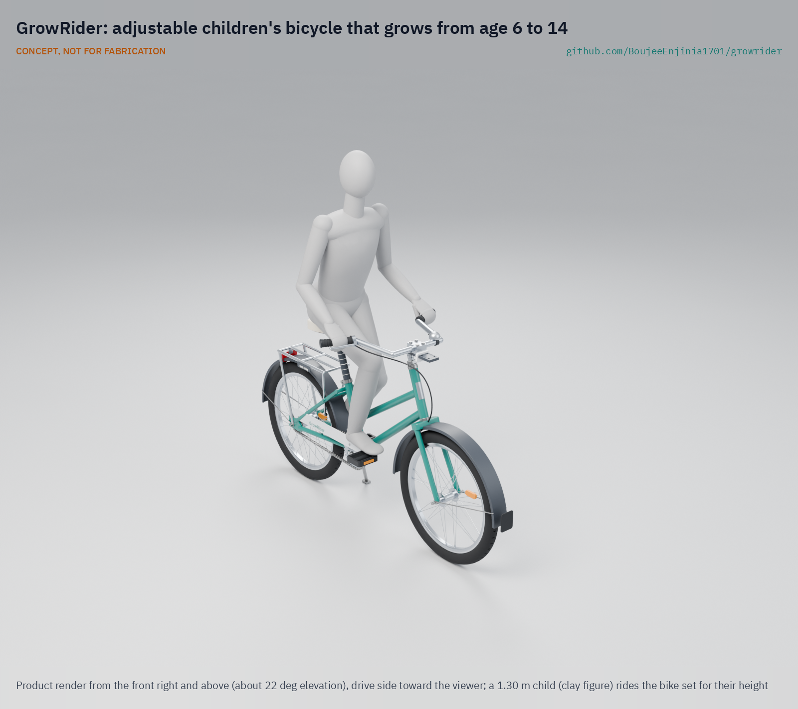
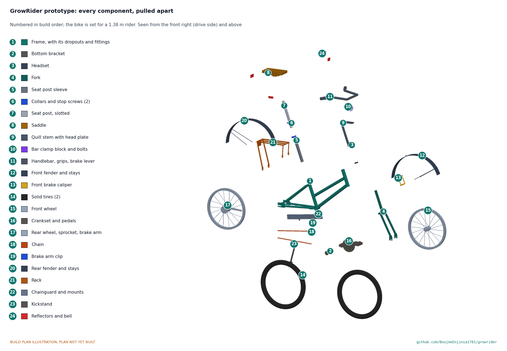

# GrowRider

     

**Area:** Mobility and Logistics · **TRL:** 3 of 9 (proof of concept on paper) · **Value-engineering target:** USD 300 (estimated USD 311 with the helmet) · **Difficulty:** 2 of 5

Rugged, repairable children's bicycle with an adjustable frame that fits ages 6 to 14, puncture-proof tires, a coaster brake and a small rated rack, built from parts common to regional adult bicycles.

[Exploded render](media/render-exploded.png) · [Detail render](media/render-detail.png) · [Interactive 3D model](media/viewer.html) · [Concept blueprint (PDF)](media/concept-blueprint.pdf) · [General arrangement GRR-DWG-001 (PDF)](cad/drawings/GRR-DWG-001.pdf) · [Sizing calculations](docs/04-calcs/01-sizing.md) · [Prototype build plan](docs/05-build-plan.md) · [Design decisions](docs/06-design-decisions.md) · [Review note](docs/REVIEW.md)

## Concept rationale

Children grow out of a fixed frame in two or three years, and in rural households one bicycle often has to serve several siblings over a decade. GrowRider answers that with adjustment instead of new frames: a two-stage telescoping seat post and a long quill stem stretch one 20 in step-through bicycle across riders from about 1.10 to 1.65 m, and the wear parts (chain, coaster hub internals, 1 in headset, 25.4 mm seat post, 9/16 in pedals) are the ones already sold for the region's adult roadsters, so any market mechanic can keep it running.

The design is open and garage-buildable because the people best placed to make and repair it are local frame builders and bicycle assemblers, not a distant factory. Publishing the geometry, the calculations and the bill of materials under CERN-OHL-S lets a school network, an NGO workshop or a regional assembler build it, change it for local parts and share the changes back.

## Burning platform

UNESCO reports that [251 million children and youth are out of school](https://www.unesco.org/en/articles/251m-children-and-youth-still-out-school-despite-decades-progress-unesco-report), that more than half of the world's out-of-school children and adolescents live in sub-Saharan Africa, and that 33 % of school-age children in low-income countries are out of school against 3 % in high-income countries. Distance is one of the barriers: in Bihar, India, a program that gave girls a bicycle to continue to secondary school raised their age-appropriate enrollment by 32 % and cut the gender gap by 40 %, with the largest effect in villages far from a school ([Muralidharan and Prakash, *American Economic Journal: Applied Economics*, 2017](https://www.aeaweb.org/articles?id=10.1257/app.20160004)).

The journey itself is dangerous. The World Health Organization reports that [road traffic injuries are the leading cause of death for children and young adults aged 5 to 29](https://www.who.int/news-room/fact-sheets/detail/road-traffic-injuries), with about 1.16 million road deaths a year, 92 % of them in low- and middle-income countries. A children's bicycle for these roads has to fit the child, stop reliably and be kept in repair, not just be cheap.

## Where it could be used

### By industry

| Industry | Use |
| --- | --- |
| Education | School bicycle fleets for rural primary and lower secondary pupils, loaned and refitted each year |
| Humanitarian and development NGOs | A children's model alongside existing adult roadster distribution and mechanic training |
| Bicycle assembly and retail | A regional children's frame built from roadster spares already in stock |
| Community health and social protection | Transport support bundled with school-feeding or cash-transfer programs |
| Local workshops and vocational training | A teaching project for frame building, wheel building and bicycle repair |

### By country or region

| Country or region | Why it matters there |
| --- | --- |
| Sub-Saharan Africa (for example Zambia, Kenya, Malawi) | More than half of the world's out-of-school children live in the region ([UNESCO](https://www.unesco.org/en/articles/251m-children-and-youth-still-out-school-despite-decades-progress-unesco-report)), and rugged adult roadsters and their spare-parts networks are already established |
| India (for example Bihar) | State bicycle programs for schoolgirls have measurably raised enrollment ([Muralidharan and Prakash, 2017](https://www.aeaweb.org/articles?id=10.1257/app.20160004)); younger pupils are not served by adult bicycles |
| Latin America (for example Bogotá, Colombia) | Bogotá's mobility and education departments run Al Colegio en Bici, which takes public-school pupils to school on guided cycle routes; in 2024 more than 9,000 students from 147 public schools used it and the city's other guided cycling and walking programs ([Alcaldía de Bogotá](https://bogota.gov.co/mi-ciudad/educacion/movilidad-en-bogota-al-colegio-en-bici-beneficios-para-estudiantes)). One adjustable frame could serve pupils of many sizes in such programs |
| Southeast Asia (for example Cambodia) | In July 2026, 200 donated bicycles went to pupils of five schools in Banteay Meanchey province, where many had walked several kilometres a day to class ([Agence Kampuchea Presse](https://www.akp.gov.kh/post/detail/374647)); a bicycle that grows with the child lasts longer in such donations |
| Netherlands and other high-income cycling countries | In a 2026 study of Dutch primary school children, 64 % cycled to school at least once a week ([Veldman, Westerbroek and Singh, *Transportation Research Interdisciplinary Perspectives*, 2026](https://doi.org/10.1016/j.trip.2026.101998)); an adjustable frame that is handed down suits families and school loan fleets and cuts the number of outgrown bikes |

## What sparked the idea

The starting point was the Chief Minister's Bicycle program in Bihar, India, launched in 2006, which gave every girl who enrolled in grade 9 Rs 2,000 (about $40) to buy a bicycle. Muralidharan and Prakash's evaluation ([*American Economic Journal: Applied Economics*, 2017](https://www.aeaweb.org/articles?id=10.1257/app.20160004); [NBER working paper 19305](https://www.nber.org/papers/w19305)) found that it raised girls' age-appropriate secondary enrollment by 32 % and worked best where the school was far from the village, so time and safety on the road were the barrier. The program reached teenagers entering secondary school, who can ride a standard bicycle. GrowRider asks what the same idea would need to reach the younger, smaller children who walk just as far: a frame that fits a six-year-old, grows to fit a fourteen-year-old, and is then handed down.

## Problem

Rural children often walk more than an hour each way to school, and adult bicycles do not fit them while imported children's bikes break quickly and cannot be repaired locally. Design with, not for: requirements must come from co-design sessions and field trials with the intended users through a local partner.

## Concept

Rugged, repairable children's bicycle with an adjustable frame that fits ages 6 to 14, puncture-proof tires, a coaster brake and a small rated rack, built from parts common to regional adult bicycles.

Full design precis: [docs/02-concept.md](docs/02-concept.md). The TRL 3 calculations ([GRR-CAL-001](docs/04-calcs/01-sizing.md)) find the fit range, reach, wheel size and rack meet their requirements on paper. With the recommendations Amish accepted on 2026-09-25 ([GRR-DDR-002](docs/decisions/0002-recommendations-accepted.md)), mass fell from 15.3 to 14.4 kg; with the parts added to make the design buildable ([GRR-DDR-003](docs/decisions/0003-design-for-construction.md)) it is 15.1 kg against the 13 kg production goal and still not met. Value-engineering target: USD 300. Estimated cost of the constructable design: USD 311 with the child helmet supplied with every bike (USD 11 over the target), USD 299 for the bike alone (USD 1 under). Braking margins for the smallest rider, the fit-change time and steerer strength are at risk.

## Key components

- Step-through frame with chromoly main tubes, a two-stage telescoping seat post (saddle 400 to 670 mm) and a long chromoly quill stem
- 20 in (ISO 406) alloy-rim wheels with solid puncture-proof tires
- Coaster brake hub plus front rim brake
- 140 mm cranks
- Single-speed chain drive
- Aluminium rear rack, rated 10 kg
- Reflectors and bell

The priced bill of materials is in [bom/bom.csv](bom/bom.csv): USD 311 with the child helmet supplied with every bike and USD 299 for the bike alone, against a USD 300 value-engineering target. The parametric model is [cad/src/model.py](cad/src/model.py), with STEP files in `cad/step/`.

## Building the prototype

The [prototype build plan](docs/05-build-plan.md) (GRR-BLD-001) shows how to make each of the eight made components, from the rear dropouts and the brazed chromoly frame to the slotted seat post, the quill stem with its head plate and the welded aluminium rack, and how to put all 24 components together in 17 steps, each with a picture drawn from the model. Making the concept buildable added track-end dropouts, stop screws in the seat post collars, a two-position bar clamp on a head plate and fixings for the rack, fenders, kickstand and chainguard, recorded in [GRR-DDR-003](docs/decisions/0003-design-for-construction.md). A local frame builder can make the components and any bicycle mechanic can assemble them. Decisions still open are in the [design decisions register](docs/06-design-decisions.md). Nobody may ride the prototype until it has passed the ISO 4210-2 tests.

## Safety

> **Safety:** Nothing has been built or tested. Rack load is limited to 10 kg for child safety. Frame, fork, seat post, stem and brakes must pass the tests of ISO 4210-2 (the standard that applies by saddle height) before anyone rides it.

## Repository layout

| Folder | Contents |
| --- | --- |
| `docs/` | Problem, concept, requirements, calculations and design decisions |
| `cad/src/` | build123d Python source, the source of truth for all geometry |
| `cad/step/`, `cad/stl/` | Exported models for FreeCAD, other CAD tools and printing |
| `cad/drawings/` | 2D sketches and dimensioned drawings |
| `bom/` | Bill of materials |
| `electronics/` | KiCad schematics and PCB layouts |
| `firmware/` | Microcontroller code |
| `media/` | Renders, perspectives and photos |
| `build-log/` | Dated prototyping notes |

## Documentation

Controlled documents follow the portfolio [documentation standard](.kit/STANDARDS.md). Each carries a document ID (GRR-PRC-001 for the precis), a version and a revision history. Branded PDFs are built with `python .kit/render.py` and attached to GitHub Releases when a document is tagged, for example `GRR-PRC-001/v1.0`.

## Credits

Designed by Amish Chadha. See [CONTRIBUTORS.md](CONTRIBUTORS.md) for roles. To cite this design, use [CITATION.cff](CITATION.cff) (GitHub shows it as "Cite this repository").

AI assistance (Claude) was used to accelerate concept renders, prototype documentation and first-pass sizing calculations. Design direction and all decisions are Amish Chadha's, recorded in this repository's decision records (`docs/decisions/`).

## Licenses

- **Hardware** (CAD, drawings, BOM, electronics): [CERN-OHL-S v2](LICENSE)
- **Software** (firmware, scripts, notebooks): [MIT](LICENSE-SOFTWARE)

A project of the [Design Molecule](https://designmolecule.com) lab.
