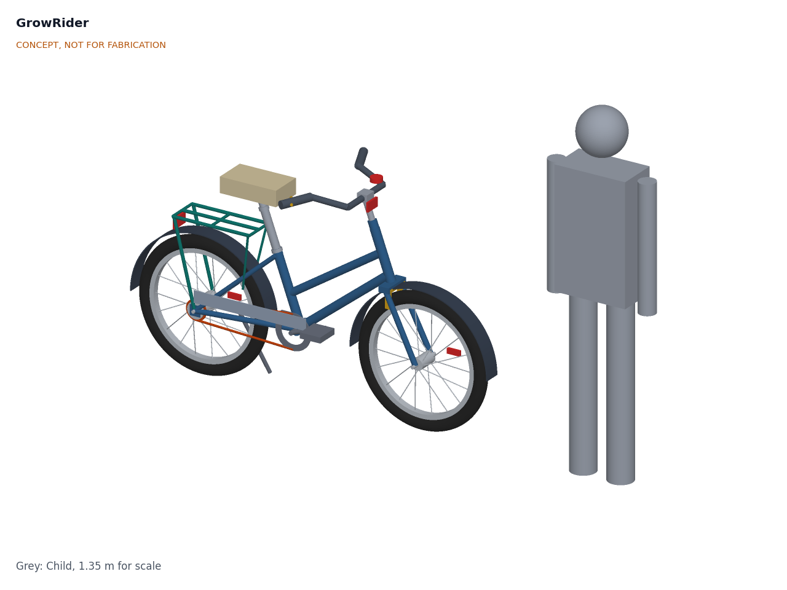
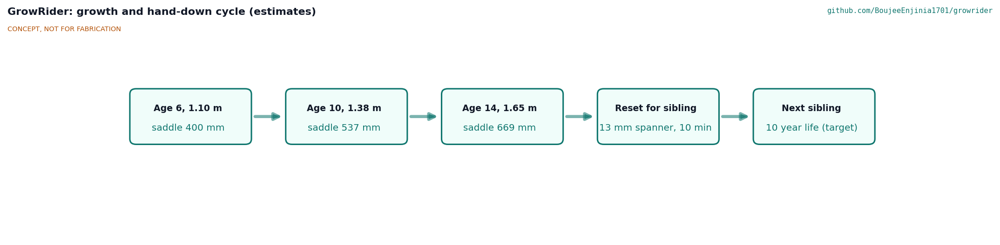
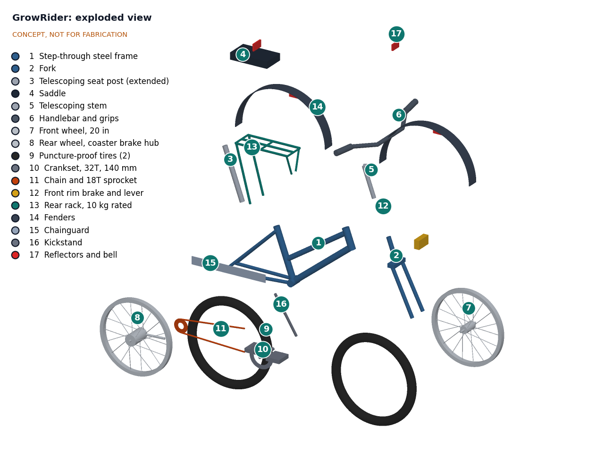

# GrowRider design precis

GrowRider is a step-through chromoly steel children's bicycle on 20 in wheels whose seat post and stem telescope, so one bike fits riders from about 1.10 to 1.65 m (ages about 6 to 14) and can be handed down between siblings. It uses a coaster brake plus a front rim brake, puncture-proof tires, a single-speed chain drive and a small rack rated 10 kg, with wear parts shared with the region's adult roadsters. The calculation note GRR-CAL-001 v0.3 shows on paper that the fit range, reach, wheel size and rack meet their requirements; mass (about 14.4 kg against the 13 kg production goal) is not met; prototype cost ($281, $293 with helmet) is within the $300 budget approved by Amish on 2026-09-26, but the production cost is not yet estimated; and braking margins for the smallest rider, the fit-change time and steerer strength are at risk. Wheel size, brakes, frame type, tires and crank length were decided by Amish on 2026-09-25 (GRR-DDR-001), and on the same day he accepted the TRL 3 recommendations: chromoly main tubes, steerer, quill and sleeve, an aluminium rack, alloy rims and bar, a wider R2 and a split R9 (GRR-DDR-002).

*Figure 1. GrowRider parametric model (`cad/src/model.py`) set for a 1.38 m rider, beside a 1.35 m child (about 10 years old) for scale.*

## How it works

1. **Fit the rider.** A parent, teacher or mechanic sets saddle height with a two-stage telescoping seat post (a 29.2 x 1.8 mm chromoly sleeve that slides 130 mm in the 31.8 mm seat tube, then a standard 25.4 mm seat post that slides 140 mm in the sleeve) and sets handlebar height with a long 22.2 mm quill stem that slides 120 mm in the 1 in fork steerer. Each sliding part keeps at least 100 mm of insertion, shown by a permanent mark and backed by a positive stop. All three clamps use 13 mm bolts.
2. **Ride to school.** The rider pedals a single-speed chain drive (32T chainring, 18T sprocket, 140 mm cranks) at about 65 rpm for 11 km/h. Solid or airless tires cannot go flat on thorns.
3. **Stop.** Pedaling backward engages the coaster brake in the rear hub. A front rim brake with a short-reach lever gives a second, independent brake that still works if the chain comes off.
4. **Carry a school bag.** A small rear rack, rated and marked 10 kg, carries a bag or books. It is sized for a bag, not a passenger or a water container.
5. **Grow and hand down.** As the child grows, the post and stem are raised. When the child moves to an adult roadster, both are lowered and the bike passes to a younger sibling. Worn parts are replaced from the roadster parts already sold in the local market.

*Figure 2. Growth and hand-down cycle. Saddle heights are estimates from the crank-corrected fit rule in GRR-CAL-001, Table 2; the 10-year life is a target.*

## Main components

Item numbers match the exploded view (Figure 3) and `bom/bom.csv`.

| # | Component | Choice | Notes |
| --- | --- | --- | --- |
| 1 | Frame | Step-through frame with twin down tubes; chromoly 4130 main tubes: 31.8 x 1.2 mm seat tube, 280 mm long; 31.8 x 0.9 mm down tube; 28.6 x 0.9 mm loop tube; 180 mm head tube; steel stays | Decided 2026-09-25 (D3, D7). Low stepping point (455 mm) for small riders and school skirts |
| 2 | Fork | 20 in fork, 30 mm offset, 1 in threaded chromoly steerer with 220 mm usable above the crown (D10) | Standard 1 in headset as on roadsters; steerer longer than a stock 20 in fork |
| 3 | Telescoping seat post | 29.2 x 1.8 mm chromoly sleeve, 250 mm long (D10), plus 25.4 mm seat post, 280 mm long | 270 mm of travel in two stages (130 and 140 mm); saddle 400 to 670 mm from the BB |
| 4 | Saddle | Child size, light color cover | Light color stays cooler in sun |
| 5 | Telescoping stem | Long 22.2 mm chromoly quill (235 mm below the clamp), 120 mm travel, two-position head (0 or 60 mm forward) | Adjusts bar height (113 mm) and reach |
| 6 | Handlebar and grips | 22.2 mm alloy swept-back bar (D7), 520 mm wide, 160 mm sweep | Upright position for visibility |
| 7 | Front wheel | 20 in (ISO 406) alloy rim (D8), 28 spokes, nutted axle | Decided 2026-09-25 (D1); 15 mm axle nuts as on roadsters |
| 8 | Rear wheel | 20 in (ISO 406) alloy rim (D7) with coaster brake hub | Hub type widely used on regional roadsters (to confirm) |
| 9 | Tires (2) | 20 x 1.95 in solid or airless | Decided 2026-09-25 (D4) |
| 10 | Crankset | 140 mm cranks, 32T ring, 9/16 in pedal threads | One length decided 2026-09-25 (D5); adult pedals fit |
| 11 | Chain and sprocket | 1/2 x 1/8 in chain, 18T sprocket | Same chain as roadsters |
| 12 | Front brake | Side-pull caliper, short-reach adjustable lever | Second, independent brake; decided 2026-09-25 (D2) |
| 13 | Rear rack | 12 x 1.5 mm aluminium 6061-T6 tube (D7), 300 x 120 mm platform at 575 mm, 10 kg marked | No footrests or passenger seat |
| 14 | Fenders | Pair, full coverage | Rainy-season mud and school uniforms |
| 15 | Chainguard | Full plate over the upper chain run | Keeps clothing out of the chain |
| 16 | Kickstand | Rear-mounted | Parking at school |
| 17 | Reflectors and bell | Front white, rear red, spoke and pedal reflectors, bell | Road visibility |

*Figure 3. Exploded view with item numbers matching the BOM. The bottom bracket, headset, hardware and helmet (BOM lines 18 to 20) are not modeled.*

## Key numbers

All values come from the calculation note GRR-CAL-001 v0.3 and its script `docs/04-calcs/sizing.py`; they are paper estimates. The general arrangement is drawing GRR-DWG-001 (`cad/drawings/GRR-DWG-001.pdf`).

**Fit.** Assumptions: inseam is about 0.45 times standing height. Rule A sets saddle height (BB center to saddle top) at 0.88 times inseam; rule B sets saddle top to pedal at the bottom of the stroke at 1.09 times inseam, which accounts for the 140 mm crank. The design covers both.

| Rider height | Inseam (0.45 x height) | Saddle height, rule A | Saddle height, rule B |
| --- | --- | --- | --- |
| 1.10 m (about age 6) | 495 mm | 436 mm | 400 mm |
| 1.38 m (about age 10) | 621 mm | 546 mm | 537 mm |
| 1.65 m (about age 14) | 742 mm | 653 mm | 669 mm |

Table 1. Saddle height across the fit range (GRR-CAL-001, Table 2).

| Quantity | Value | Basis | Requirement |
| --- | --- | --- | --- |
| Saddle height range | 400 to 670 mm (270 mm) | Two stages of 130 and 140 mm, 100 mm insertion each | R2 met |
| Saddle rise and setback over the range | 254 mm up, 92 mm back | 270 mm along a 70° seat axis | |
| Handlebar height range | 113 mm | 120 mm of quill travel along a 70° steering axis | R3 met |
| Reach adjustment | 141 mm (241 mm shortest, 382 mm longest) | Seat and steering geometry, 0 or 60 mm stem head, ±15 mm saddle rail | R3 met; shortest is 21 mm above the 220 mm placeholder for a 1.10 m rider |
| Standover at the stepping point | 455 mm | Loop tube top 100 mm ahead of its seat-tube joint | R1 met; 40 mm below a 1.10 m rider's inseam |
| Saddle top above ground | 636 to 890 mm | 260 mm BB height | Classifies the bike under ISO 4210-2 (city and trekking) |
| Grips relative to saddle | +128 mm (smallest) to -13 mm (largest) | 180 mm head tube needed for quill insertion | Very upright for small riders |
| Trail | 59 mm | 70° head angle, 30 mm fork offset | |
| Pedal clearance | 109 mm; strike at about 32° lean | 260 mm BB, 140 mm cranks | |
| Toe overlap | None (1.10 m) to 19 mm (1.65 m) with the bar turned | 480 mm front center | Tell riders |
| Gear development | 2.79 m per crank turn | 32/18 on a 1.57 m rolling circumference | 66 rpm at 11 km/h |
| Power on the level at 11 km/h | 26 to 51 W (34 W at 1.38 m) | Rolling coefficient 0.02 (solid tire on gravel), CdA 0.35 m² | Sustainable for a child |
| Power on a 5 % climb at 7 km/h | 46 to 101 W (63 W at 1.38 m) | Same, plus gravity | Short climbs only; steep hills walked |
| Mass | 14.4 kg (15.3 kg before GRR-DDR-002) | Frame 2.41 kg from the model's tubes, wheels 2.75, solid tires 2.2, drive 1.45, rack 0.44, other parts 5.1 kg | **R5 (13 kg production goal) not met** |
| Rear coaster brake alone, grip limit | 0.26 to 0.28 g dry, 0.19 g on loose gravel | μ (L - x) / (L + μh) with the rider-plus-bike mass center | Front brake needed on gravel |
| Coaster brake, smallest rider | 0.23 g | 83 N back-pedal force needed for 0.2 g, about 93 N available (assumed hub brake ratio 2.5) | R7 at risk |
| Front rim brake, smallest rider | 0.24 g dry; about 0.15 g wet with the alloy rim (0.05 g with steel) | 33 N lever force for 0.2 g dry, 40 N assumed | R7 at risk; alloy rim decided (D8) |
| Both brakes, dry | 0.47 to 0.58 g | Sum, capped by grip and pitch-over (0.57 to 0.81 g) | R7 target 0.35 g met on paper |
| Rack | 10 kg; 26 MPa in the aluminium rails at 2.5 g (110 MPa welded 6061-T6) | 300 x 120 mm platform; front wheel load falls from 40 % to 32 % with 10 kg for the smallest rider | R6 met |
| Strength screen | 1 of 6 sections above its screen: steerer at the crown in hard braking (117 MPa against 90 MPa for chromoly); sleeve 61 MPa, quill 77 MPa and seat tube 72 MPa pass (3 of 6 above before GRR-DDR-002) | Largest rider, largest setting | R12 at risk |
| Prototype parts cost | $281 for the bike, $293 with helmet ($243 and $255 before GRR-DDR-002) | `bom/bom.csv` | Within the $300 budget (top-up approved 2026-09-26); R11 at risk until production cost is estimated |

**Commute time.** Assumptions: a 5 km trip each way; walking at 4 to 5 km/h; cycling at 10 to 12 km/h on dirt roads.

| Mode | Speed | One way | Round trip |
| --- | --- | --- | --- |
| Walking | 4 to 5 km/h | 60 to 75 min | 2.0 to 2.5 h |
| GrowRider | 10 to 12 km/h | 25 to 30 min | 50 to 60 min |
| Time returned to the child | | 30 to 50 min | 60 to 100 min per day; about 79 min per day and 249 h per 190-day school year at the midpoints |

Table 2. School trip time, walking and cycling (estimates).

## Key design choices

- **Wheel size: 20 in (ISO 406).** 20 in keeps standover at 455 mm so a 1.10 m child can stand over the frame, and gives lower mass. 24 in (ISO 507) rolls better on ruts but raises standover to about 510 mm and fails R1 for the smallest riders. Neither is a regional roadster size, so tires and rims are the one commonality gap either way. Decided by Amish, 2026-09-25 (GRR-DDR-001, D1).
- **Brakes: coaster brake plus front rim brake.** A coaster brake is simple, weather-proof, needs no hand strength, and uses hub internals common on regional roadsters. On its own it fails completely if the chain comes off and is marginal on loose gravel (about 0.19 g). Adding a front rim brake gives two independent brakes. Alternatives: coaster only (cheaper, one failure mode away from no brake) or two hand brakes without a coaster (needs hand strength small children may lack). Decided by Amish, 2026-09-25: coaster plus front rim brake (GRR-DDR-001, D2). GRR-CAL-001 finds the smallest rider's margins small and a wet steel rim nearly useless, so an alloy front rim was decided (GRR-DDR-002, D8), and the coaster hub's brake ratio is to be obtained before further brake work (D9).
- **Step-through frame.** Lower standover than a diamond frame, and practical for school uniforms and skirts. It needs twin down tubes to keep the frame stiff. Decided by Amish, 2026-09-25 (GRR-DDR-001, D3).
- **Mass and materials.** Chromoly 4130 main tubes, an aluminium rack, alloy rims and an alloy bar, keeping the solid tires, with 13 kg kept as the production goal. Decided by Amish, 2026-09-25: go with recommendation (GRR-DDR-002, D7). The result is 14.4 kg, not the 13.6 kg first estimated, and it adds $38 to the prototype.
- **Sliding parts and steerer.** Chromoly steerer and quill and a 29.2 x 1.8 mm chromoly sleeve, which needs a 1.2 mm seat tube wall to fit. Decided by Amish, 2026-09-25: go with recommendation (GRR-DDR-002, D10). The steerer is still above its screen in hard braking; a 2.0 mm wall is proposed (N2).
- **Puncture-proof tires.** Solid or airless tires remove thorn punctures entirely but add about 0.5 kg for the pair (GRR-CAL-001), ride harsher and roll less freely. Thorn-resistant tubes with tire liners keep standard parts and a softer ride, but still puncture occasionally. Decided by Amish, 2026-09-25: solid or airless for the prototype, and ask users in co-design (GRR-DDR-001, D4).
- **Parts commonality.** Chain, coaster hub internals, 1 in headset, 25.4 mm seat post, 22.2 mm handlebar and 9/16 in pedal threads are chosen to match adult roadster parts. Children's bikes often use 1/2 in pedal threads; GrowRider does not.
- **Head tube and steerer length.** A 180 mm head tube and 30 mm headset stack give the quill 220 mm of steerer, enough for 120 mm of travel with 100 mm of insertion at full height. The cost is a high bar for the smallest rider (128 mm above the saddle).
- **Bolted clamps, not quick releases.** 13 mm bolts discourage casual changes and theft of the seat post, and every mechanic already has the spanner.

## Safety

> **Safety:** GrowRider is ridden by children on roads shared with trucks and motorbikes. It is a concept. No part of it has been built or tested, and it must not be ridden until the frame, fork, sliding joints, rack and brakes have passed the tests of the applicable standard (ISO 8098 or ISO 4210) at a later TRL.

- **Brakes.** Two independent brakes are required (R7). The coaster brake stops working if the chain comes off, so the front brake is not optional. Small hands need a short-reach lever. Riders need to be shown that a hard front brake on loose gravel can skid the front wheel. A wet steel rim gives a child almost no front braking (about 0.05 g), so an alloy rim is specified (about 0.15 g wet).
- **Telescoping parts.** A seat post or stem raised past its minimum insertion can break or pull out. Every sliding part carries a permanent minimum insertion mark at 100 mm, and a positive stop bolt (BOM line 19) stops the part at that point. At full extension the sleeve and quill are the most stressed sections (GRR-CAL-001, section K). Clamp slots are pinch points for fingers.
- **Rack limit.** The rack is rated 10 kg and marked. It must not carry passengers, water containers or goods above the rating: a heavy load high over the rear wheel makes a light bike hard for a child to steer and can lift the front wheel. The rack is sized for a school bag, with no footrests.
- **Road visibility.** School trips often start and end near dawn or dusk. Front white, rear red, spoke and pedal reflectors are fitted, and a bright frame color is proposed. A light (for example a hub dynamo) is suggested for a later version.
- **Helmet.** An adjustable, ventilated child helmet is proposed with each bike (BOM line 20). Hot-climate comfort will decide whether it is worn, so it needs to be discussed in co-design. Funding is proposed, awaiting Amish.
- **Aluminium rack.** Welded aluminium has a low fatigue strength and cracks without warning; the rack must pass static and fatigue tests before use, and the 10 kg rating marking matters more than before.
- **Clothing and hot surfaces.** The chainguard keeps skirts and trousers out of the chain. A light saddle cover limits heating in the sun.
- **Mass.** At about 14.4 kg, the bike is about 76 % of the weight of a 19 kg six-year-old. This makes pushing, lifting and controlling a fall harder for the smallest riders, and is the reason R5 matters.

## Open questions

- Reduce mass toward the 13 kg production goal: with chromoly, aluminium and alloy parts adopted (D7), the bike is 14.4 kg. The remaining option, pneumatic tires with liners (0.5 kg), would reverse D4. Can local frame builders work chromoly and weld aluminium, and are the lighter parts stocked?
- Low bar option: would a flat bar suit the smallest riders, whose grips sit 128 mm above the saddle? A co-design question (GRR-DDR-002, D13).
- Sliding joints in dust and rain: will greased steel sleeves seize over years of use? Would a split collar with a wiper seal or a plastic bushing help?
- Crank length: one 140 mm length for the prototype was decided on 2026-09-25 (D5). It is 0.28 of a 1.10 m rider's inseam; the 127 mm swap remains a later option.
- Standard: by maximum saddle height (890 mm) GrowRider falls under ISO 4210-2 (city and trekking). Its test loads assume adult riders; whether to also meet ISO 8098 limits for the small settings needs the standards' text.
- Confirm with a partner which roadster parts are actually stocked in the target region, including coaster hubs and 20 in tires.
- Test the anthropometric assumptions (inseam ratio, reach) with measurements of children in the target region, where average heights may be below global references.

Concept media: [blueprint sheet](../media/concept-blueprint.pdf), [interactive 3D model](../media/viewer.html).
